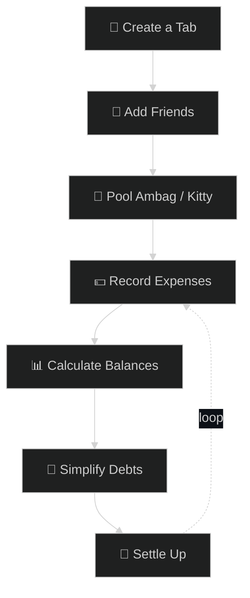

 

---

## 💸 About Evenly

Evenly is a personal project built to solve a simple but common problem: splitting money when going out with friends.

After a meal, trip, or gala, figuring out who paid, who owes who, and how much everyone needs to send can get confusing. **Evenly makes the process simple** — create a tab, record expenses, see everyone's balance, and settle up.

> No accounts. No complicated setup. Just share the tab and go.

---

## ✨ Features

### 🧾 Core Splitting

<table>
<tr>
<td width="50%">

**💸 Equal & Custom Splits**
Split expenses evenly or assign exact amounts.

**🔢 Real-Time Exact Split Allocation**
Live `₱X.XX remaining` display updates as you type, with dynamic status badges — green when fully matched, amber when under-allocated, rose when over-allocated. A `+Remaining` shortcut instantly assigns any leftover balance to a member.

**🧮 Debt Simplification**
Calculates simpler ways to settle group balances, minimizing the number of transactions needed.

</td>
<td width="50%">

**⚡ Real-Time Sync**
Changes update instantly across devices via Supabase Realtime.

**👥 Member Management**
Add or remove members while protecting outstanding balances.

**📜 Payment History**
Keep track of completed settlements and undo mistakes.

</td>
</tr>
</table>

### 🐖 Group Fund / Ambag (Kitty) Tracking

- Support for upfront pool contributions, whether even or uneven.
- Designate a group treasurer/collector to manage the pool.
- Real-time dashboard calculating **Collected**, **Spent**, and **Remaining in Pool**.
- Automatic refund calculations built into the suggested settle-up flow.

### 🏠 Homepage & Tab Management

- **Recent Tabs Settlement Status Badges** — live status tags on the homepage showing *"All settled"* or *"₱X.XX unsettled"*, calculated from real-time balances.
- **Inline Tab Renaming** — quick-edit button next to the tab name in the header, syncing renames instantly across Supabase and local browser history.
- **Shareable Tabs** — create a tab and share it with friends, no account required.
- Dedicated `/new` route for fast tab generation.

### 📱 Payments & PWA

- **GCash, Maya & QR Ph** — add payment details or upload a personal QR code.
- **Installable PWA** — add Evenly to your phone's home screen and use it like a native app.
- **Dark & Light Mode** — responsive UI with persistent theme preferences.

### ⚙️ Behind the Scenes

- **Client-Side Storage Optimization** — uploaded QR codes are automatically resized and compressed to ~50 KB WebP to stay well within Supabase free-tier limits.
- **Automatic File Cleanup** — orphaned QR images in storage are cleaned up whenever an image is replaced or a tab/member is deleted.

---

## 🛠️ Built With

| Frontend | Backend | Deployment | Other |
|---|---|---|---|
| Next.js | Supabase | Vercel | qrcode.react |
| TypeScript | PostgreSQL | | |
| Tailwind CSS | Supabase Realtime | | |
| Lucide React | Supabase Storage | | |
| PWA (manifest + service worker) | | | |

---

## 🔄 How It Works

---

## 🚀 Deployment

Evenly is deployed with **Vercel**, with **Supabase** handling the database, real-time synchronization, and QR code storage.

---

## 🎨 Branding & Identity

- Official Evenly SVG logo, replacing the temporary header emoji.
- Minimalist creator signature — *"Built by EJO"* — in the homepage footer.

---

## 👨‍💻 Personal Project

Built by **Edmarc Justin C. Oabel** as a personal project to explore full-stack web development while creating something useful for everyday situations.

